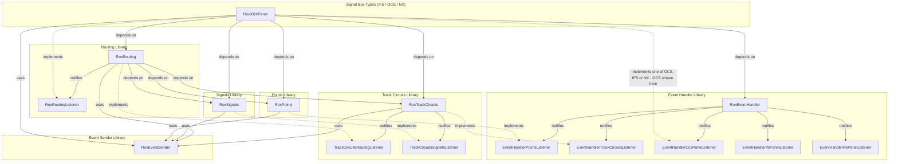

# High Level Architecture

```mermaid
flowchart TB

    %% As this is a high-level diagram, don't spell out all three box types separately.

    subgraph Panels["Signal Box Types (IFS / OCS / NX)"]
        XXX["RoxXXXPanel"]
    end

    %% Each library grouped together

    subgraph RoutingLibrary["Routing Library"]
        Routing["RoxRouting"]
        RoutingListener["RoxRoutingListener"]
    end

    subgraph SignalsLibrary["Signals Library"]
        Signals["RoxSignals"]
    end

    subgraph PointsLibrary["Points Library"]
        Points["RoxPoints"]
    end

    subgraph TrackCircuitsLibrary["Track Circuits Library"]
        TrackCircuits["RoxTrackCircuits"]
        TrackCircuitsRoutingListener["TrackCircuitsRoutingListener"]
        TrackCircuitsSignalsListener["TrackCircuitsSignalsListener"]
    end

    subgraph EventSenderLibrary["Event Sender Library"]
        EventSender["RoxEventSender"]
    end

    subgraph EventHandlerLibrary["Event Handler Library"]
        EventHandler["RoxEventHandler"]
        EventHandlerPointsListener["EventHandlerPointsListener"]
        EventHandlerTrackCircuitsListener["EventHandlerTrackCircuitsListener"]
        EventHandlerOcsPanelListener["EventHandlerOcsPanelListener"]
        EventHandlerIfsPanelListener["EventHandlerIfsPanelListener"]
        EventHandlerNxPanelListener["EventHandlerNxPanelListener"]
    end

    %% Depends on is where the class is passed into the constructor of the object.

    XXX -->|depends on| Routing
    XXX -->|depends on| Signals
    XXX -->|depends on| Points
    XXX -->|depends on| TrackCircuits
    XXX -->|depends on| EventHandler

    Routing -->|depends on| Signals
    Routing -->|depends on| Points
    Routing -->|depends on| TrackCircuits

    %% Notifies is the process of a library calling one of its listeners

    Routing -->|notifies| RoutingListener
    TrackCircuits -->|notifies| TrackCircuitsRoutingListener
    TrackCircuits -->|notifies| TrackCircuitsSignalsListener
    EventHandler -->|notifies| EventHandlerPointsListener
    EventHandler -->|notifies| EventHandlerTrackCircuitsListener
    EventHandler -->|notifies| EventHandlerOcsPanelListener
    EventHandler -->|notifies| EventHandlerIfsPanelListener
    EventHandler -->|notifies| EventHandlerNxPanelListener

    %% Implements is where a class implements one of the other class's interfaces.

    XXX -.->|implements| RoutingListener
    Signals -.->|implements| TrackCircuitsSignalsListener
    Routing -.->|implements| TrackCircuitsRoutingListener
    Points -.->|implements| EventHandlerPointsListener
    TrackCircuits -.->|implements| EventHandlerTrackCircuitsListener
    XXX -.->|implements one of OCS, IFS or NX - OCS shown here| EventHandlerOcsPanelListener

    Routing -->|uses| EventSender
    Signals -->|uses| EventSender
    Points -->|uses| EventSender
    TrackCircuits -->|uses| EventSender
    XXX -->|uses| EventSender

```