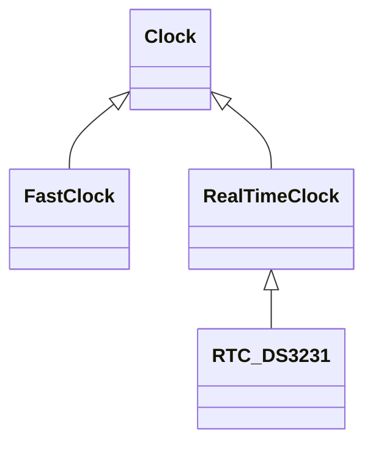

The Roxeter code has been structured into reusable libraries to allow sharing between the different types of control panel, avoiding the need for code to be written (or copied) multiple times.

The following libraries have either been written or are envisaged.

